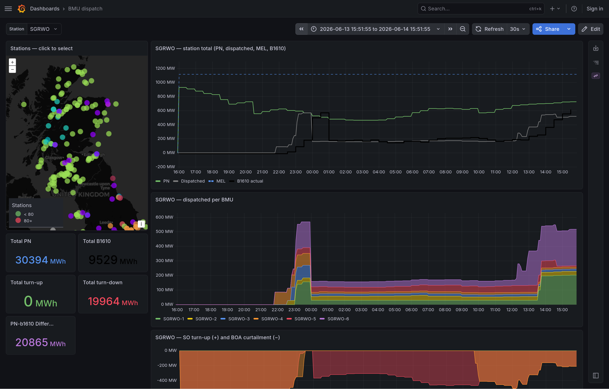
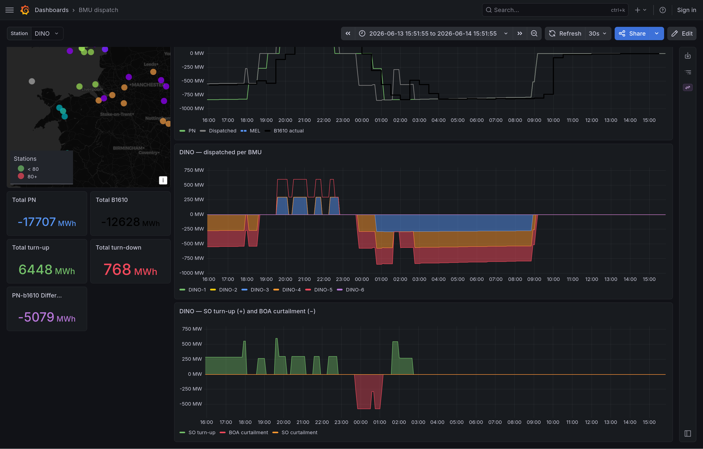
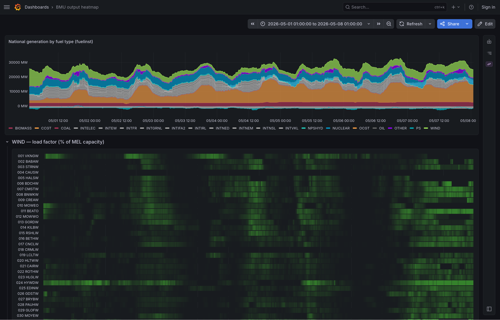
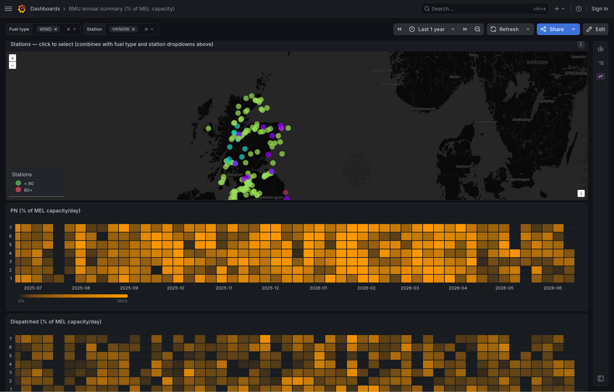

# gb-grid

**gb-grid** builds and continuously updates a queryable database of Great
Britain's electricity grid, sourced from
[Elexon's BMRS Insights API](https://data.elexon.co.uk/bmrs/api/v1) — the
official near-real-time data feed for the GB electricity balancing and
settlement system. It downloads generation, balancing-action, and
plant-capacity data, stores it in a [TimescaleDB](https://www.timescale.com/)
(PostgreSQL) database, and ships a set of [Grafana](https://grafana.com/)
dashboards on top for exploration.

It's aimed at anyone who wants to poke at how the GB grid actually behaves —
energy hobbyists, researchers, students, or developers prototyping against real
balancing-mechanism data. With it you can explore questions like:

- How much wind generation is being **curtailed** (paid to switch off), and at which wind farms?
- What is each power station actually generating, versus what it planned to?
- How is the system operator **dispatching** individual units minute to minute?
- How does the national fuel mix (wind / gas / nuclear / interconnectors / …) shift across a day?

The whole stack runs from a single `docker compose up` — Postgres, Grafana, and
a background ingester that keeps the data current. If you use [Nix](https://nixos.org/),
there's a dev shell layered on the same services.



> [!CAUTION]
> This repo is almost entirely vibe-coded. Do not expect quality, but also, let me assure you it would be even worse if I attempted to write this myself.

## Quick start

The whole stack runs through `docker compose` — Postgres (TimescaleDB), Grafana
(provisioned with the dashboards), and the ingester.

```bash
docker compose up -d --build          # or: just docker-up
docker compose run --rm app gb-grid backfill --from 2026-04-01 --to 2026-05-01
docker compose run --rm app gb-grid materialize-dispatch --from 2026-04-01 --to 2026-05-01
open http://localhost:3000            # Grafana — anonymous Editor; admin/admin to log in
```

`materialize-dispatch` builds the per-BMU dispatch series the dispatch
dashboards read from; run it after each backfill (the always-on ingester rolls
it forward automatically from then on).

Postgres is on host `127.0.0.1:5433` (db/user `gb_grid`, password `gbgrid` by
default — override via a `.env`, see `.env.example`). The `app` service applies
migrations then runs the always-on ingester; one-off CLI commands run as
`docker compose run --rm app gb-grid <cmd>`.

> The TimescaleDB and Grafana images are pulled from their official registries
> at run time — this repo only ships its own app image and config, so it
> doesn't redistribute either of them.

## Developing (Nix)

`nix develop` is a thin toolchain shell (Python, uv, ruff, just, psql client)
layered on top of the **same** Docker services — it is not a second way to run
the stack. Entering it runs `docker compose up -d db grafana`, syncs `.venv`,
and applies migrations, with `GB_GRID_DATABASE_URL` and the `PG*` vars pointed at
the compose Postgres (`127.0.0.1:5433`, user/password `gb_grid`/`gbgrid`). So
`psql`, `pg_dump`, GUI clients, the test suite, and the CLI all run natively
against the containerized DB:

```bash
nix develop
gb-grid backfill --from 2026-04-01 --to 2026-05-01
gb-grid materialize-dispatch --from 2026-04-01 --to 2026-05-01   # per-BMU dispatch series for the dashboards
gb-grid run                # always-on ingester (run under systemd in prod)
gb-grid status
gb-grid sql                # opens psql against $GB_GRID_DATABASE_URL
```

Requires the Docker daemon (`virtualisation.docker.enable` on NixOS). The
`app`/ingester container is left stopped in the devShell so you can drive it
natively; `just docker-up` runs the full always-on stack instead.

## What's in the database

Most data is keyed by **BMU** (Balancing Mechanism Unit) — the grid's unit of
account for a generator or large consumer (a wind farm, a gas turbine, an
interconnector, a battery). The `bmu` table maps each BMU to a power station,
fuel type, and map coordinates; the time-series tables below hang off it.

| Table | What it is | Cadence |
|---|---|---|
| `bmu` | Static registry: BMU → station, fuel type, latitude/longitude | one-off (vendored) |
| `fuelinst` | National generation broken down by fuel type (wind, gas, nuclear, interconnectors, …) | 5 min |
| `b1610` | Actual metered generation, per BMU (settlement-grade actuals) | 30 min, ~5 working days lag |
| `pn` | Physical Notifications — each unit's own planned output | 5 min |
| `boalf` | Balancing acceptances — the system operator's instructions telling units to change output | 5 min |
| `mels` | Maximum Export Limits — the most each unit can currently export (its live available capacity) | 5 min |
| `system_prices` | Imbalance settlement prices | hourly |
| `constraints` | NESO day-ahead network constraint flows | daily |

From these, `gb-grid materialize-dispatch` derives `bmu_dispatch` — a per-BMU,
5-minute reconciliation of planned vs. instructed vs. actual output, including
**turn-up** (instructed to generate more) and **curtailment** (instructed to
generate less, e.g. wind paid off when the network is congested). That's what
the dispatch dashboards read.

## Data sources

- **[Elexon BMRS Insights API](https://bmrs.elexon.co.uk/)** — the live grid
  data feed (`fuelinst`, `b1610`, `pn`, `boalf`, `mels`, `system_prices`). Free,
  no key required.

  > Elexon data is accessed under the [following open license terms](https://www.elexon.co.uk/bsc/data/balancing-mechanism-reporting-agent/copyright-licence-bmrs-data/)
  
- **[NESO](https://www.neso.energy/data-portal)** (National Energy System
  Operator) — the day-ahead constraint flows, and the BMU registry used to build
  the static `bmu` table.
- **[OSUKED](https://osuked.github.io/Power-Station-Dictionary/)** — BMU → fuel
  type and power-station mapping.
- **[REPD](https://www.gov.uk/government/publications/renewable-energy-planning-database-monthly-extract)**
  (the UK government's Renewable Energy Planning Database) — station coordinates
  and project links.

The `bmu` table is a one-off merge of the last three, vendored as a CSV
(`src/gb_grid/migrations/0004_bmu.csv`); everything else is fetched live.

## Acknowledgements

The approach to ingesting and reconciling the BMRS streams draws heavily on
Energy Systems Catapult's
[`uk-live-generation`](https://github.com/ES-Catapult/uk-live-generation), which
served as a reference for a lot of the processing here.

## CLI

- `gb-grid migrate` — apply pending yoyo migrations
- `gb-grid backfill --from YYYY-MM-DD --to YYYY-MM-DD [--dataset fuelinst,b1610,...]`
- `gb-grid materialize-dispatch --from YYYY-MM-DD --to YYYY-MM-DD [--bmu PEHE-1 ...]` — recompute per-BMU dispatch series into `bmu_dispatch` (5-min resolution, only BMUs with BOA acceptances in the window)
- `gb-grid run` — always-on async scheduler (also rolls the materialized table forward)
- `gb-grid status` — row counts and latest timestamps
- `gb-grid sql` — open `psql` against the configured database

## Dashboards

`docker compose` runs Grafana on <http://localhost:3000> (anonymous Editor
access; admin/admin if you want to log in), provisioned from
`docker/grafana/provisioning/` (datasource uid `gbgrid`, pointed at the `db`
service) plus the dashboards in `grafana/dashboards/`.

### BMU dispatch

Pick a station (or click one on the map) to see its aggregate planned vs.
instructed vs. actual output, a stacked per-BMU breakdown, and the turn-up /
curtailment the system operator instructed.


The bottom panel separates instructed **turn-up** (green, generate more) from
**curtailment** (red, generate less) per BMU:



> [!NOTE]
> The PN / Dispatched / B1610 series on the station-total panel still need
> work: the three are sourced from different streams (interpolated PN+BOALF
> vs. half-hourly settlement actuals) and don't always reconcile cleanly,
> especially around BOA acceptances and during B1610's ~5-working-day lag.
> Treat them as a sanity check on each other, not as the same number.

### BMU output heatmap

National generation by fuel type, with per-station load-factor heatmaps (output
as a % of each station's MEL capacity) grouped by fuel — a quick read on which
plants are running hard and which are idle.



### BMU annual summary

A year of daily output per station as a calendar heatmap, either in absolute
MWh/day or — pictured — as a % of MEL capacity, alongside a map for selecting
stations and fuel types.



Backfill, then materialize, then open Grafana:

```bash
gb-grid backfill --from 2026-04-01 --to 2026-04-07
gb-grid materialize-dispatch --from 2026-04-01 --to 2026-04-07
xdg-open http://localhost:3000/d/bmu-dispatch
```

## Migrations

Schema lives in `src/gb_grid/migrations/` as numbered SQL files, applied with
[yoyo-migrations](https://ollycope.com/software/yoyo/latest/). Add a new file
(e.g. `0002.add-foo.sql`) and `gb-grid migrate` will apply it on next run.

## Configuration

| Env var | Purpose | Default |
|---|---|---|
| `GB_GRID_DATABASE_URL` | Postgres connection URL | _(set by devShell; required otherwise)_ |
| `GB_GRID_API_BASE` | BMRS API base URL | `https://data.elexon.co.uk/bmrs/api/v1` |
| `GB_GRID_HTTP_TIMEOUT` | HTTP timeout (seconds) | `60` |
| `GB_GRID_POLL_SECONDS` | Scheduler tick interval for every loop | `3600` |
| `GB_GRID_POLL_<DATASET>_SECONDS` | Override one loop; `<DATASET>` is `FUELINST`, `BOALF`, `B1610`, `PN`, `MELS`, `SYSTEM_PRICES`, `MATERIALIZE`, `MATERIALIZE_DAILY` | `GB_GRID_POLL_SECONDS` |

## Deployment
I've deployed this myself in "production" at home using nixos on proxmox — you can see
[`nix-config/gb-grid.nix`](https://github.com/chrsphr/nix-config) as an example for the host
recipe. The flake exposes `packages.default` (the Python app) for downstream
consumers.
